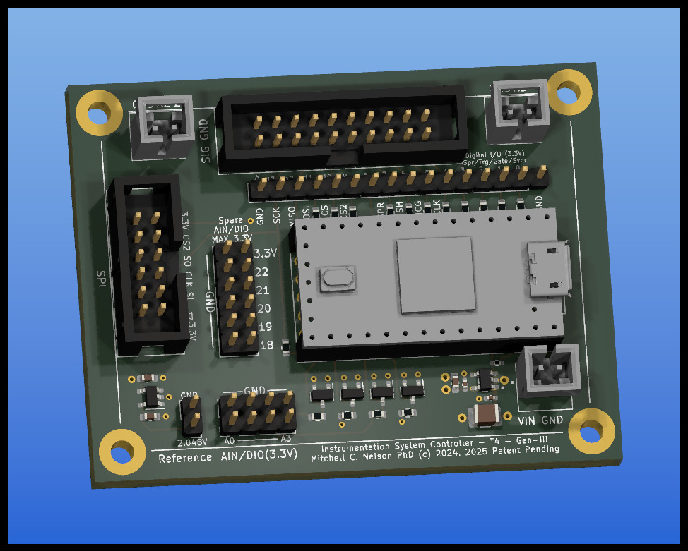

# Instrumentation-Controller-T4.0-Rev3
Instrumentation Controller/carrier for Teens 4.0, with power panagement, keyed connectors for CCD (SPI+FlexPWM), SPI, DIO, diode protecfted analog inputs, and precision 2.048 voltage reference.

This repo provides gerbers for the revised controller for the SPI instrumentation project.  This allows you to control peripherals with both SPI and precisely time clock signals generated by the Teensy 4.0's FlexPWM module.

You need this specific controller for the latest version CCD sensor devices, and this will be the standard for the SPI instrumentation project going forward.

The following image of the layout shows the interconnects with the host MCU carrier (the Teensy 4.0).

The 20 pin keyed connector (J2) is intended for instrumentation boards such as the TCD1304 that require SPI and precisely clocked control signals.  This connector carries the first SPI, with pin 10 for CS, plus 4 signal pins - pin 7, the three "A" outputs from FlexPWM2 Submodules 0 through 2 (pins 4 through 6), plus two pins for 3.3V power and the second row is ground.
The single row connector just below (J3), duplicates the top row of digital i/o pins from the Teensy 4.0.
The keyed 12 pin connector on the left (J7) carries SPI0 with pin 9 as CS.
The double row header adjacent to it (J8), carries digital i/o pins 18 through 22 plus 3.3V and the second row is ground.
The double row 8 pin header (J1) are analog inputs A0 through A3 and ground.
The two pin header (J6) is the 2.048V precision voltage reference.

The power output connector at the top right (J5) is +5V controlled by a USB compatible current limit switch.  Peripheral boards that require +5V should connect here, and especially so if the have inductive power filtering. 
The power output connector at the top left (J4) is +3.3V from the onboard LDO voltage regulator of the Teensy 4.0.
The power output at the lower right (J9) is a direct connection to the USB 5V line through the Teensy 4.0.

